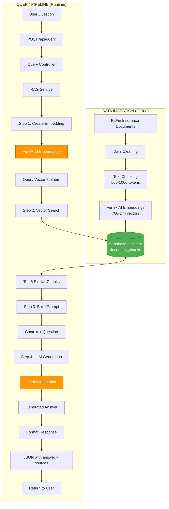
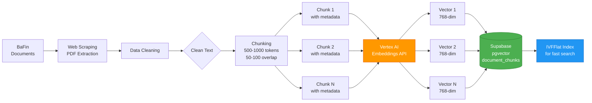
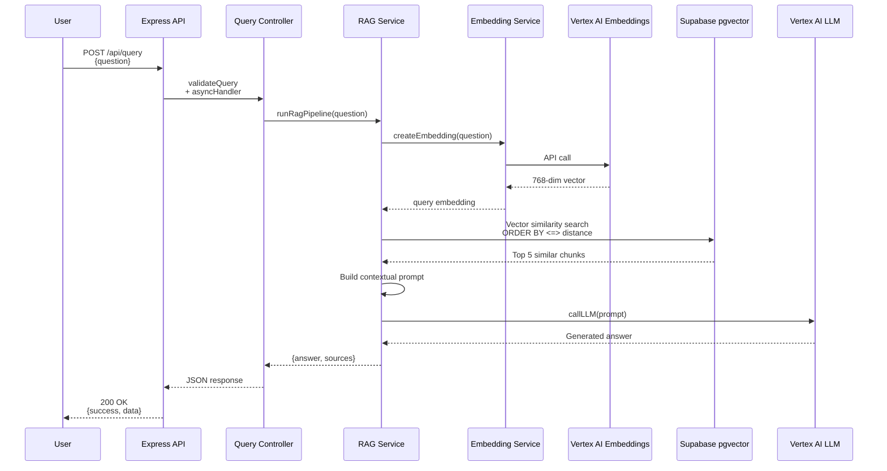
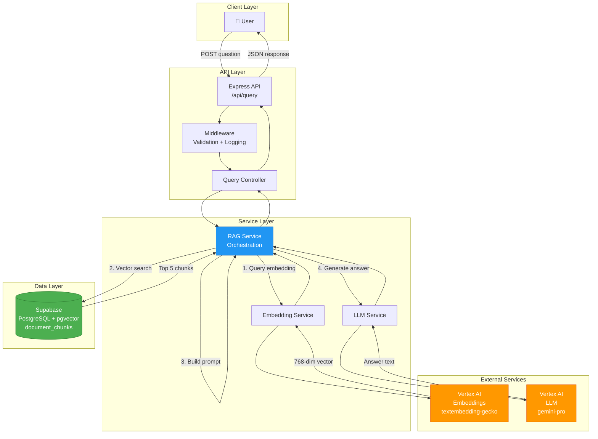

# Day 4: RAG Pipeline Diagrams & Data Flow

Complete visual documentation of the Retrieval-Augmented Generation (RAG) pipeline for the German Insurance AI Backend.

---

## Table of Contents

1. [RAG Pipeline Overview](#1-rag-pipeline-overview)
2. [Data Ingestion Flow](#2-data-ingestion-flow-bafin--cleaning--chunking--embedding)
3. [Query Processing Flow](#3-query-processing-flow-query--embedding--vector-search--context)
4. [Shareable Diagrams](#4-shareable-diagrams)

---

## 1. RAG Pipeline Overview

### High-Level Architecture

```
┌────────────────────────────────────────────────────────────────┐
│                    RAG PIPELINE SYSTEM                          │
│                                                                 │
│  ┌──────────────────┐              ┌──────────────────┐        │
│  │   DATA INGESTION │              │  QUERY PIPELINE  │        │
│  │    (Offline)     │              │    (Runtime)     │        │
│  └──────────────────┘              └──────────────────┘        │
│          │                                  │                   │
│          ↓                                  ↓                   │
│  ┌─────────────────────────────────────────────────────────┐   │
│  │              VECTOR DATABASE (Supabase + pgvector)       │   │
│  │                                                          │   │
│  │  ┌────────────────────────────────────────────────┐     │   │
│  │  │  document_chunks                               │     │   │
│  │  │  • id, document_id, insurer_id                │     │   │
│  │  │  • chunk_text (TEXT)                          │     │   │
│  │  │  • embedding (VECTOR(768))                    │     │   │
│  │  │  • metadata (JSONB)                           │     │   │
│  │  └────────────────────────────────────────────────┘     │   │
│  └─────────────────────────────────────────────────────────┘   │
│                                                                 │
│  External Services:                                            │
│  • Vertex AI Embeddings (textembedding-gecko)                 │
│  • Vertex AI LLM (gemini-pro / gemini-1.5-flash)              │
└────────────────────────────────────────────────────────────────┘
```

### Complete RAG Flow Diagram



---

## 2. Data Ingestion Flow (BaFin → Cleaning → Chunking → Embedding)

### Detailed Data Ingestion Pipeline

```
┌─────────────────────────────────────────────────────────────────┐
│                    DATA INGESTION PIPELINE                       │
│                         (Offline Process)                        │
└─────────────────────────────────────────────────────────────────┘

STEP 1: DATA COLLECTION
┌───────────────────────────────────────────────────────────────┐
│  📄 Insurance Document Sources                                 │
│                                                                │
│  • BaFin (German Federal Financial Supervisory Authority)     │
│    - Regulatory documents                                     │
│    - Insurance company listings                               │
│    - Consumer information                                     │
│                                                                │
│  • Insurance Company Websites                                 │
│    - Product brochures (PDF, HTML)                           │
│    - Policy terms and conditions                             │
│    - FAQ pages                                               │
│                                                                │
│  • Public Insurance Data                                      │
│    - Wikipedia insurance articles                            │
│    - Government healthcare info                              │
└────────────────────────┬──────────────────────────────────────┘
                         │
                         ↓
STEP 2: DATA CLEANING
┌───────────────────────────────────────────────────────────────┐
│  🧹 Text Cleaning & Normalization                              │
│                                                                │
│  Operations:                                                   │
│  ✓ Remove HTML tags: <div>, <p>, <span>, etc.               │
│  ✓ Extract text from PDFs (using PyPDF2 or similar)         │
│  ✓ Normalize German characters:                              │
│    - ä, ö, ü, ß preserved correctly                          │
│  ✓ Remove excessive whitespace                               │
│  ✓ Fix encoding issues (UTF-8 normalization)                 │
│  ✓ Remove headers, footers, page numbers                     │
│  ✓ Filter out:                                               │
│    - Advertisements                                          │
│    - Navigation elements                                     │
│    - Copyright notices                                       │
│    - Boilerplate text                                        │
│                                                                │
│  Input:  Raw HTML/PDF/Text                                    │
│  Output: Clean, normalized German text                        │
└────────────────────────┬──────────────────────────────────────┘
                         │
                         ↓
STEP 3: TEXT CHUNKING
┌───────────────────────────────────────────────────────────────┐
│  ✂️  Semantic Text Chunking                                    │
│                                                                │
│  Strategy: Sliding Window with Overlap                        │
│                                                                │
│  Parameters:                                                   │
│  • Chunk size: 500-1000 tokens (~2000-4000 characters)       │
│  • Overlap: 50-100 tokens (~200-400 characters)              │
│  • Splitting method: Sentence boundaries                      │
│                                                                │
│  Why overlap?                                                  │
│  - Ensures context isn't lost at chunk boundaries            │
│  - Improves retrieval of information spanning chunks         │
│                                                                │
│  Metadata preserved:                                          │
│  • Source document ID                                         │
│  • Insurer ID                                                 │
│  • Chunk index (position in document)                        │
│  • Document type (policy, FAQ, brochure)                     │
│  • Page number (if from PDF)                                 │
│  • Section heading                                           │
│                                                                │
│  Example:                                                      │
│  ┌─────────────────────────────────────────────────┐         │
│  │ Chunk 1: "Health insurance in Germany comes..." │         │
│  │          (tokens 0-800, overlap 0-100)          │         │
│  ├─────────────────────────────────────────────────┤         │
│  │ Chunk 2: "...comes in two forms. Public..."    │         │
│  │          (tokens 700-1500, overlap 700-800)     │         │
│  └─────────────────────────────────────────────────┘         │
│                                                                │
│  Input:  Clean text document                                  │
│  Output: Array of text chunks with metadata                   │
└────────────────────────┬──────────────────────────────────────┘
                         │
                         ↓
STEP 4: EMBEDDING GENERATION
┌───────────────────────────────────────────────────────────────┐
│  🧠 Vector Embedding via Vertex AI                            │
│                                                                │
│  Model: textembedding-gecko@latest (or similar)              │
│  Dimension: 768                                               │
│                                                                │
│  Process:                                                      │
│  ┌──────────────────────────────────────────┐                │
│  │  for each chunk:                         │                │
│  │    embedding = await vertexAI.embed(     │                │
│  │      text: chunk.text,                   │                │
│  │      task: "RETRIEVAL_DOCUMENT"          │                │
│  │    )                                     │                │
│  │    chunk.embedding = embedding.values    │                │
│  └──────────────────────────────────────────┘                │
│                                                                │
│  Batching: Process 100-250 chunks at a time for efficiency   │
│                                                                │
│  Input:  Text chunk: "Health insurance in Germany..."        │
│  Output: 768-dim vector: [0.23, -0.45, 0.12, ..., 0.89]     │
│                                                                │
│  Vector properties:                                           │
│  • Semantic similarity captured in vector space              │
│  • Similar concepts have similar vectors                     │
│  • Used for cosine similarity search                         │
└────────────────────────┬──────────────────────────────────────┘
                         │
                         ↓
STEP 5: DATABASE STORAGE
┌───────────────────────────────────────────────────────────────┐
│  💾 Store in Supabase (PostgreSQL + pgvector)                 │
│                                                                │
│  Table: document_chunks                                       │
│  ┌─────────────────────────────────────────────────┐         │
│  │ id               UUID (PRIMARY KEY)             │         │
│  │ document_id      UUID (FK → documents)          │         │
│  │ insurer_id       UUID (FK → insurers)           │         │
│  │ chunk_text       TEXT                           │         │
│  │ chunk_index      INTEGER                        │         │
│  │ token_count      INTEGER                        │         │
│  │ embedding        VECTOR(768) ← KEY FIELD        │         │
│  │ metadata         JSONB                          │         │
│  │ created_at       TIMESTAMP                      │         │
│  └─────────────────────────────────────────────────┘         │
│                                                                │
│  SQL Insert:                                                   │
│  ┌──────────────────────────────────────────┐                │
│  │ INSERT INTO document_chunks (            │                │
│  │   document_id,                           │                │
│  │   chunk_text,                            │                │
│  │   embedding,                             │                │
│  │   metadata                               │                │
│  │ ) VALUES (                               │                │
│  │   $1, $2, $3::vector, $4::jsonb          │                │
│  │ );                                       │                │
│  └──────────────────────────────────────────┘                │
│                                                                │
│  Index Created:                                               │
│  CREATE INDEX ON document_chunks                             │
│  USING ivfflat (embedding vector_cosine_ops)                 │
│  WITH (lists = 100);                                         │
│                                                                │
│  Index enables fast vector similarity search                 │
└───────────────────────────────────────────────────────────────┘

RESULT: Vector database populated with searchable embeddings ✅
```

### Data Ingestion Mermaid Diagram



### Data Statistics Example

```
Sample Ingestion Run:
━━━━━━━━━━━━━━━━━━━━━━━━━━━━━━━━━━━━━━━━━━━━━━━
Documents processed:     250
Total text extracted:    5.2 GB
After cleaning:          3.8 GB
Chunks created:          12,450
Average chunk size:      750 tokens
Embeddings generated:    12,450 vectors
Database size:           ~450 MB (with indexes)
Processing time:         ~2 hours
━━━━━━━━━━━━━━━━━━━━━━━━━━━━━━━━━━━━━━━━━━━━━━━
```

---

## 3. Query Processing Flow (Query → Embedding → Vector Search → Context)

### Detailed Query Pipeline

```
┌─────────────────────────────────────────────────────────────────┐
│                    QUERY PROCESSING PIPELINE                     │
│                         (Runtime - Real-time)                    │
└─────────────────────────────────────────────────────────────────┘

USER INPUT
┌───────────────────────────────────────────────────────────────┐
│  💬 User asks a question                                        │
│                                                                │
│  Example: "What types of health insurance are available        │
│            in Germany?"                                        │
└────────────────────────┬──────────────────────────────────────┘
                         │ HTTP POST Request
                         ↓
API ENDPOINT
┌───────────────────────────────────────────────────────────────┐
│  🌐 Express API Endpoint                                       │
│                                                                │
│  POST /api/query                                              │
│  Content-Type: application/json                               │
│                                                                │
│  Request Body:                                                 │
│  {                                                            │
│    "question": "What types of health insurance are           │
│                 available in Germany?"                        │
│  }                                                            │
└────────────────────────┬──────────────────────────────────────┘
                         │
                         ↓
MIDDLEWARE LAYER
┌───────────────────────────────────────────────────────────────┐
│  🛡️  Request Processing                                         │
│                                                                │
│  1. requestLogger middleware                                   │
│     → Logs incoming request                                   │
│                                                                │
│  2. validateQuery middleware                                   │
│     → Check question exists                                   │
│     → Check question is string                                │
│     → Check length < 1000 characters                          │
│     → Sanitize input                                          │
│                                                                │
│  3. asyncHandler wrapper                                       │
│     → Catches any async errors                                │
└────────────────────────┬──────────────────────────────────────┘
                         │
                         ↓
CONTROLLER
┌───────────────────────────────────────────────────────────────┐
│  📨 Query Controller (query.controller.js)                     │
│                                                                │
│  export const handleQuery = async (req, res) => {            │
│    const { question } = req.body;                            │
│    const result = await runRagPipeline(question);            │
│                                                                │
│    res.json({                                                 │
│      success: true,                                           │
│      data: result                                             │
│    });                                                        │
│  };                                                           │
│                                                                │
│  Delegates to RAG Service ↓                                   │
└────────────────────────┬──────────────────────────────────────┘
                         │
                         ↓
━━━━━━━━━━━━━━━━━━━━━━━━━━━━━━━━━━━━━━━━━━━━━━━━━━━━━━━━━━━━━━━
                    RAG SERVICE PIPELINE
━━━━━━━━━━━━━━━━━━━━━━━━━━━━━━━━━━━━━━━━━━━━━━━━━━━━━━━━━━━━━━━

STEP 1: QUERY EMBEDDING
┌───────────────────────────────────────────────────────────────┐
│  🔢 Generate Query Vector                                      │
│                                                                │
│  Service: embedding.service.js                                │
│  Function: createEmbedding(question)                          │
│                                                                │
│  ┌──────────────────────────────────────┐                    │
│  │ Input Question:                      │                    │
│  │ "What types of health insurance are  │                    │
│  │  available in Germany?"              │                    │
│  └──────────────┬───────────────────────┘                    │
│                 │                                             │
│                 ↓                                             │
│  ┌──────────────────────────────────────┐                    │
│  │  Vertex AI Embeddings API            │                    │
│  │  Model: textembedding-gecko@latest   │                    │
│  │  Task: RETRIEVAL_QUERY               │                    │
│  │                                      │                    │
│  │  API Call:                           │                    │
│  │  const response = await vertex.      │                    │
│  │    predict({                         │                    │
│  │      instances: [{ content: text }], │                    │
│  │      parameters: {                   │                    │
│  │        task_type: "RETRIEVAL_QUERY"  │                    │
│  │      }                               │                    │
│  │    });                               │                    │
│  └──────────────┬───────────────────────┘                    │
│                 │                                             │
│                 ↓                                             │
│  ┌──────────────────────────────────────┐                    │
│  │ Query Embedding (768-dim vector):    │                    │
│  │ [0.123, -0.456, 0.789, 0.234, ...]  │                    │
│  └──────────────────────────────────────┘                    │
│                                                                │
│  ⏱️  Typical latency: 100-300ms                               │
│  🔄 Retry on failure: 2 attempts with backoff                │
│  ⏰ Timeout: 10 seconds                                        │
└────────────────────────┬──────────────────────────────────────┘
                         │
                         ↓
STEP 2: VECTOR SIMILARITY SEARCH
┌───────────────────────────────────────────────────────────────┐
│  🔍 Find Similar Document Chunks                               │
│                                                                │
│  Database: Supabase (PostgreSQL + pgvector)                   │
│  Function: supabase.rpc('match_documents', ...)               │
│                                                                │
│  SQL Query Executed:                                          │
│  ┌──────────────────────────────────────────────────────┐    │
│  │ SELECT                                                │    │
│  │   id,                                                 │    │
│  │   document_id,                                        │    │
│  │   chunk_text,                                         │    │
│  │   metadata,                                           │    │
│  │   1 - (embedding <=> $1::vector) as similarity       │    │
│  │ FROM document_chunks                                  │    │
│  │ WHERE 1 - (embedding <=> $1::vector) > $2            │    │
│  │ ORDER BY embedding <=> $1::vector                     │    │
│  │ LIMIT $3;                                             │    │
│  └──────────────────────────────────────────────────────┘    │
│                                                                │
│  Parameters:                                                   │
│  • $1 = query_embedding (768-dim vector)                      │
│  • $2 = match_threshold (0.7 - only relevant results)         │
│  • $3 = match_count (5 - top 5 chunks)                        │
│                                                                │
│  Operator: <=> (cosine distance)                              │
│  • Distance 0 = identical vectors                             │
│  • Distance 2 = opposite vectors                              │
│  • Similarity = 1 - distance                                  │
│                                                                │
│  Index Used: IVFFlat (Inverted File with Flat quantization)   │
│  • Approximate nearest neighbor search                        │
│  • Much faster than exact search                              │
│  • 95%+ accuracy with proper tuning                           │
│                                                                │
│  ┌──────────────────────────────────────────────────────┐    │
│  │ Results (Top 5 Chunks):                              │    │
│  │                                                       │    │
│  │ 1. chunk_text: "In Germany, health insurance..."    │    │
│  │    similarity: 0.89                                  │    │
│  │    document: "Health Insurance Overview"            │    │
│  │                                                       │    │
│  │ 2. chunk_text: "There are two types: public..."     │    │
│  │    similarity: 0.87                                  │    │
│  │    document: "Insurance Types Guide"                │    │
│  │                                                       │    │
│  │ 3. chunk_text: "Private health insurance is..."     │    │
│  │    similarity: 0.85                                  │    │
│  │    document: "PKV Information"                       │    │
│  │                                                       │    │
│  │ 4. chunk_text: "Statutory health insurance..."      │    │
│  │    similarity: 0.83                                  │    │
│  │    document: "GKV Regulations"                       │    │
│  │                                                       │    │
│  │ 5. chunk_text: "Coverage includes hospital..."      │    │
│  │    similarity: 0.81                                  │    │
│  │    document: "Benefits Overview"                     │    │
│  └──────────────────────────────────────────────────────┘    │
│                                                                │
│  ⏱️  Typical latency: 50-150ms (with index)                   │
│  🔄 Retry on failure: 2 attempts                              │
│  ⏰ Timeout: 5 seconds                                         │
└────────────────────────┬──────────────────────────────────────┘
                         │
                         ↓
STEP 3: CONTEXT BUILDING
┌───────────────────────────────────────────────────────────────┐
│  📝 Assemble Contextual Prompt                                 │
│                                                                │
│  Service: rag.service.js (buildPrompt function)               │
│                                                                │
│  Process:                                                      │
│  1. Join relevant chunks with separators                      │
│  2. Add system instructions                                   │
│  3. Include user question                                     │
│  4. Add response format guidelines                            │
│                                                                │
│  ┌──────────────────────────────────────────────────────┐    │
│  │ Prompt Template:                                      │    │
│  │                                                       │    │
│  │ You are an expert on German insurance. Answer the   │    │
│  │ following question based on the provided context.    │    │
│  │                                                       │    │
│  │ Context:                                             │    │
│  │ ─────────────────────────────────────────────────    │    │
│  │ In Germany, health insurance comes in two main      │    │
│  │ forms: statutory health insurance (GKV) and         │    │
│  │ private health insurance (PKV)...                   │    │
│  │                                                       │    │
│  │ There are two types: public health insurance        │    │
│  │ (Gesetzliche Krankenversicherung) which covers...  │    │
│  │                                                       │    │
│  │ Private health insurance is available for...        │    │
│  │                                                       │    │
│  │ [Additional chunks concatenated]                     │    │
│  │ ─────────────────────────────────────────────────    │    │
│  │                                                       │    │
│  │ Question: What types of health insurance are        │    │
│  │ available in Germany?                                │    │
│  │                                                       │    │
│  │ Instructions:                                        │    │
│  │ - Answer in clear, concise language                 │    │
│  │ - Use information from the context above            │    │
│  │ - If the context doesn't contain the answer, say so │    │
│  │ - Keep answer under 500 words                        │    │
│  │                                                       │    │
│  │ Answer:                                              │    │
│  └──────────────────────────────────────────────────────┘    │
│                                                                │
│  Token count: ~1500-2000 tokens (context + question)         │
└────────────────────────┬──────────────────────────────────────┘
                         │
                         ↓
STEP 4: LLM GENERATION
┌───────────────────────────────────────────────────────────────┐
│  🤖 Generate Answer with AI                                    │
│                                                                │
│  Service: llm.service.js                                      │
│  Function: callLLM(prompt, options)                           │
│                                                                │
│  ┌──────────────────────────────────────┐                    │
│  │ Vertex AI LLM API                    │                    │
│  │ Model: gemini-pro or gemini-1.5-flash│                    │
│  │                                      │                    │
│  │ Configuration:                       │                    │
│  │ • temperature: 0.7                   │                    │
│  │ • max_tokens: 1024                   │                    │
│  │ • top_p: 0.95                        │                    │
│  │ • top_k: 40                          │                    │
│  │                                      │                    │
│  │ API Call:                            │                    │
│  │ const response = await model.        │                    │
│  │   generateContent({                  │                    │
│  │     contents: [{ role: "user",      │                    │
│  │                  parts: [{ text }] }]│                    │
│  │   });                                │                    │
│  └──────────────┬───────────────────────┘                    │
│                 │                                             │
│                 ↓                                             │
│  ┌──────────────────────────────────────┐                    │
│  │ Generated Answer:                    │                    │
│  │                                      │                    │
│  │ "In Germany, there are two main     │                    │
│  │  types of health insurance:         │                    │
│  │                                      │                    │
│  │  1. Statutory Health Insurance (GKV)│                    │
│  │     - Gesetzliche Krankenversicherung│                    │
│  │     - Mandatory for most employees   │                    │
│  │     - Income-based premiums          │                    │
│  │     - Covers about 90% of residents  │                    │
│  │                                      │                    │
│  │  2. Private Health Insurance (PKV)   │                    │
│  │     - Private Krankenversicherung    │                    │
│  │     - For high earners, self-employed│                    │
│  │     - Risk-based premiums            │                    │
│  │     - More flexible coverage options │                    │
│  │                                      │                    │
│  │  Both provide comprehensive coverage │                    │
│  │  for medical care, hospital stays,   │                    │
│  │  and prescriptions."                 │                    │
│  └──────────────────────────────────────┘                    │
│                                                                │
│  ⏱️  Typical latency: 1-3 seconds                             │
│  🔄 Retry on failure: 2 attempts with backoff                │
│  ⏰ Timeout: 30 seconds                                        │
└────────────────────────┬──────────────────────────────────────┘
                         │
                         ↓
RESPONSE FORMATTING
┌───────────────────────────────────────────────────────────────┐
│  📦 Format Final Response                                      │
│                                                                │
│  Controller: query.controller.js                              │
│                                                                │
│  JSON Response:                                               │
│  ┌──────────────────────────────────────────────────────┐    │
│  │ {                                                     │    │
│  │   "success": true,                                   │    │
│  │   "data": {                                          │    │
│  │     "question": "What types of health insurance...",│    │
│  │     "answer": "In Germany, there are two main...",  │    │
│  │     "sources": [                                     │    │
│  │       {                                              │    │
│  │         "text": "In Germany, health insurance...",  │    │
│  │         "similarity": 0.89,                          │    │
│  │         "document_id": "uuid-123"                    │    │
│  │       },                                             │    │
│  │       {                                              │    │
│  │         "text": "There are two types...",           │    │
│  │         "similarity": 0.87,                          │    │
│  │         "document_id": "uuid-456"                    │    │
│  │       }                                              │    │
│  │       // ... 3 more sources                          │    │
│  │     ],                                               │    │
│  │     "metadata": {                                    │    │
│  │       "processingTime": 2134,  // milliseconds      │    │
│  │       "timestamp": "2025-12-07T10:30:45.123Z"       │    │
│  │     }                                                │    │
│  │   }                                                  │    │
│  │ }                                                    │    │
│  └──────────────────────────────────────────────────────┘    │
│                                                                │
│  HTTP Status: 200 OK                                          │
│  Content-Type: application/json                               │
└────────────────────────┬──────────────────────────────────────┘
                         │
                         ↓
USER RECEIVES ANSWER
┌───────────────────────────────────────────────────────────────┐
│  ✅ Complete Response Delivered                                │
│                                                                │
│  Total Pipeline Time: ~2-4 seconds                            │
│  • Embedding: 100-300ms                                       │
│  • Vector search: 50-150ms                                    │
│  • LLM generation: 1-3s                                       │
│  • Overhead: ~50ms                                            │
└───────────────────────────────────────────────────────────────┘
```

### Query Flow Mermaid Diagram



### Performance Metrics

```
Query Pipeline Performance (Typical):
━━━━━━━━━━━━━━━━━━━━━━━━━━━━━━━━━━━━━━━━━━━━━━━
Step 1: Query Embedding        150ms  ( 7%)
Step 2: Vector Search           80ms  ( 4%)
Step 3: Prompt Building         20ms  ( 1%)
Step 4: LLM Generation        1,800ms (88%)
─────────────────────────────────────────────
Total:                        2,050ms (100%)
━━━━━━━━━━━━━━━━━━━━━━━━━━━━━━━━━━━━━━━━━━━━━━━

Optimization opportunities:
• LLM generation is bottleneck (88% of time)
• Consider streaming responses for better UX
• Cache common questions to skip LLM call
• Use faster model (gemini-1.5-flash) for simple queries
```

---

## 4. Shareable Diagrams

### ASCII Art - Complete System

```
╔════════════════════════════════════════════════════════════════╗
║                 GERMAN INSURANCE RAG SYSTEM                     ║
╚════════════════════════════════════════════════════════════════╝

┌──────────────────────────────────────────────────────────────────┐
│                     OFFLINE: DATA INGESTION                       │
└──────────────────────────────────────────────────────────────────┘

   ┌─────────┐      ┌──────────┐     ┌──────────┐     ┌──────────┐
   │ BaFin   │─────▶│ Cleaning │────▶│ Chunking │────▶│Embedding │
   │ Docs    │      │ & Extract│     │500-1000  │     │Vertex AI │
   └─────────┘      └──────────┘     │ tokens   │     │768-dim   │
                                     └──────────┘     └─────┬────┘
                                                            │
                                                            ▼
                                                   ┌────────────────┐
                                                   │   Supabase     │
                                                   │   pgvector     │
                                                   │ document_chunks│
                                                   └────────────────┘

┌──────────────────────────────────────────────────────────────────┐
│                   RUNTIME: QUERY PROCESSING                       │
└──────────────────────────────────────────────────────────────────┘

   ┌─────────┐      ┌──────────┐     ┌──────────┐     ┌──────────┐
   │  User   │─────▶│   POST   │────▶│  Query   │────▶│   RAG    │
   │Question │      │/api/query│     │Controller│     │ Service  │
   └─────────┘      └──────────┘     └──────────┘     └─────┬────┘
                                                            │
      ┌─────────────────────────────────────────────────────┤
      │                                                     │
      ▼                                                     ▼
┌──────────┐     ┌──────────┐     ┌──────────┐     ┌──────────┐
│ Embedding│────▶│  Vector  │────▶│  Build   │────▶│   LLM    │
│  Service │     │  Search  │     │  Prompt  │     │ Generate │
│Vertex AI │     │ Supabase │     │          │     │Vertex AI │
└──────────┘     └──────────┘     └──────────┘     └─────┬────┘
                       │                                  │
                       ▼                                  │
                 ┌──────────┐                            │
                 │Top 5     │────────────────────────────┘
                 │Chunks    │
                 └──────────┘
                       │
                       ▼
                 ┌──────────┐
                 │ Answer   │
                 │+ Sources │───────▶ User
                 └──────────┘
```

### Mermaid - System Overview



### SVG-Compatible Simple Diagram

```
┌────────────────────────────────────────────────────────────────┐
│                      RAG PIPELINE FLOW                          │
├────────────────────────────────────────────────────────────────┤
│                                                                 │
│  USER QUESTION                                                  │
│       │                                                         │
│       ↓                                                         │
│  ┌─────────────┐                                               │
│  │ POST /api   │                                               │
│  │   /query    │                                               │
│  └──────┬──────┘                                               │
│         │                                                       │
│         ↓                                                       │
│  ┌──────────────────────────────────────────────┐             │
│  │         RAG SERVICE PIPELINE                 │             │
│  │                                              │             │
│  │  ①  EMBED ──→ Vertex AI ──→ Vector (768)   │             │
│  │       │                                      │             │
│  │       ↓                                      │             │
│  │  ②  SEARCH ──→ Supabase ──→ Top 5 Chunks   │             │
│  │       │                                      │             │
│  │       ↓                                      │             │
│  │  ③  PROMPT ──→ Context + Question           │             │
│  │       │                                      │             │
│  │       ↓                                      │             │
│  │  ④  LLM ──→ Vertex AI ──→ Answer            │             │
│  │                                              │             │
│  └──────────────────────────────────────────────┘             │
│         │                                                       │
│         ↓                                                       │
│  ┌─────────────┐                                               │
│  │   JSON      │                                               │
│  │  Response   │                                               │
│  └──────┬──────┘                                               │
│         │                                                       │
│         ↓                                                       │
│  USER RECEIVES ANSWER                                          │
│                                                                 │
└────────────────────────────────────────────────────────────────┘
```

---

## 5. Team Sharing & Documentation

### How to Use These Diagrams

#### For Team Members:

1. **Onboarding**: Share `day4-rag-diagrams.md` with new developers
2. **Architecture Review**: Reference diagrams in design discussions
3. **Debug Sessions**: Use flow diagrams to trace issues
4. **Documentation**: Embed diagrams in project wiki/README

#### For Stakeholders:

1. **Executive Summary**: Show high-level overview
2. **Technical Review**: Walk through data ingestion and query flow
3. **Performance Discussion**: Reference metrics and bottlenecks
4. **Cost Analysis**: Identify API call costs (Vertex AI usage)

#### Mermaid Rendering:

Mermaid diagrams can be rendered in:
- GitHub README.md (automatic rendering)
- VS Code (with Mermaid extension)
- draw.io (import Mermaid)
- Documentation sites (GitBook, Docusaurus, etc.)

#### Diagram Files:

```
docs/
├── day4-rag-diagrams.md          ← This file
├── architecture.md                ← System architecture
├── data-flow.md                   ← Detailed data flow
└── diagrams/                      ← Future: SVG exports
    ├── rag-pipeline.svg
    ├── data-ingestion.svg
    └── query-flow.svg
```

---

## 6. Key Takeaways

### RAG Pipeline Summary

**Data Ingestion (Offline)**:
1. Collect insurance documents from BaFin, websites, PDFs
2. Clean and normalize text (remove HTML, fix encoding)
3. Chunk into 500-1000 token pieces with 50-100 overlap
4. Generate 768-dim embeddings via Vertex AI
5. Store in Supabase pgvector with IVFFlat index

**Query Processing (Runtime)**:
1. User asks question → POST /api/query
2. Generate query embedding (Vertex AI) → 768-dim vector
3. Vector similarity search (Supabase) → Top 5 chunks
4. Build contextual prompt (context + question)
5. Generate answer (Vertex AI LLM) → Response text
6. Return JSON with answer + sources → User

### Performance Characteristics

- **Ingestion**: Batch process, ~2 hours for 250 documents
- **Query Latency**: 2-4 seconds end-to-end
  - Embedding: 150ms
  - Search: 80ms
  - LLM: 1.8s (88% of time)
- **Scalability**: Horizontal scaling via serverless (Cloud Run)
- **Cost**: ~$0.01-0.05 per query (Vertex AI API costs)

### Architecture Benefits

✅ **Accuracy**: Grounded in actual insurance documents
✅ **Freshness**: New documents can be ingested anytime
✅ **Explainability**: Source citations provided
✅ **Scalability**: Vector search scales to millions of chunks
✅ **Multilingual**: Supports German text natively
✅ **Extensibility**: Easy to add new data sources

---

## Completion Checklist for Day 4

- [x] RAG pipeline diagram created (multiple formats)
- [x] Data ingestion flow documented (BaFin → cleaning → chunking → embedding)
- [x] Query flow documented (query → embedding → vector search → context)
- [x] Shareable diagrams provided (ASCII, Mermaid, sequence diagrams)
- [x] Diagrams added to project documentation

**All Day 4 requirements complete! ✅**
